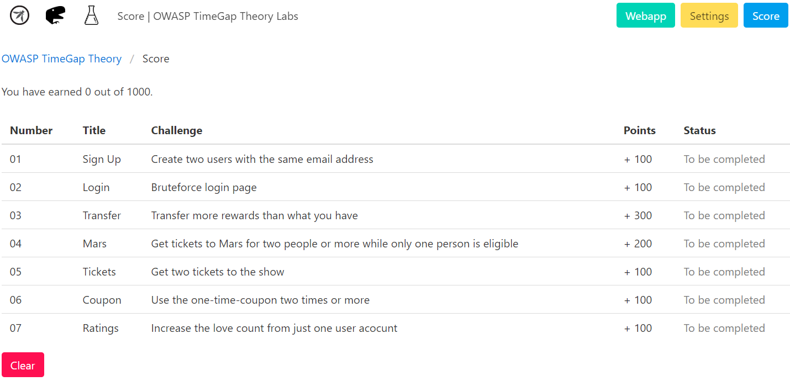

---

layout: col-sidebar
title: OWASP TimeGap Theory
tags: timegaptheory
level: 4
type: code
pitch: An auto-scoring capture-the-flag game focusing on TOCTOU vulnerabilities

---

[ OWASP TimeGap Theory](https://timegaptheory.com/)

OWASP TimeGap Theory is an auto-scoring capture-the-flag game that focuses entirely on TOCTOU vulnerabilities. There are seven unique challenges to be solved in TimeGap Theory. All of them can be solved just by using browser dev tools.

## Description

OWASP TimeGap Theory is built with PHP, MySQL, Docker and Heroku.It is built as a multi-featured web application. The goal of TimeGap Theory is to raise awareness about TOCTOU vulnerabilities amongst people. It was started as a PoC demo app for author's coworkers. But later on, it was open sourced under OWASP's umbrella.

## Contributors

In order of appearance:

* Abhi M Balakrishnan - Author
* Akhi M balakrishnan - Illustrations for the hand-guide 
* Adarsh Girijan - Coverpage design for the hand-guide
* This can be your name - We need your help to test the software and review the hand-guide.

## Licensing

OWASP TimeGap Theory is licensed under the Apache License 2.0

For more details, please visit the official website at https://timegaptheory.com/
